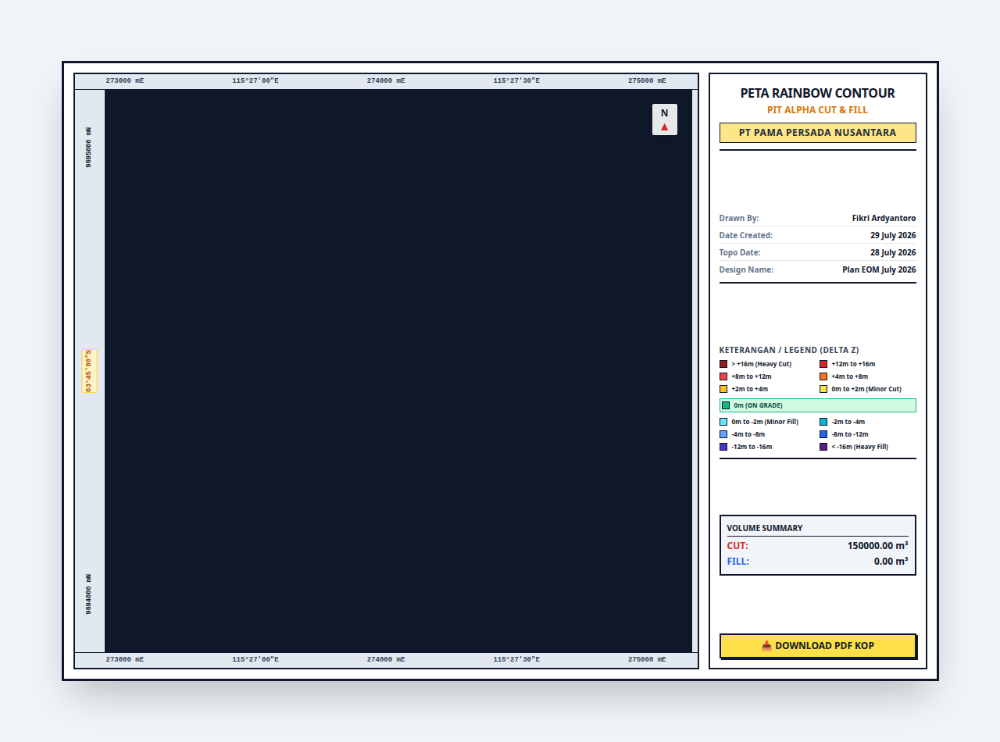
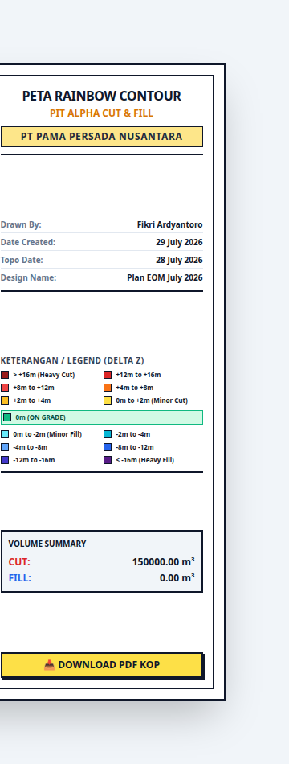

# 🌈 Rainbow Contour Engine

> High-performance Rust CLI & A4 Kop PDF generator for Cut & Fill Difference Maps in Mining Engineering.



---

## ⚡ Features

- **Grid Delta Engine**: Calculates spatial elevation deltas ($\Delta Z = Z_{\text{design}} - Z_{\text{topo}}$) from 3D Face DXF surfaces.
- **Marching Squares Contours**: Generates vector isoline contours at $2\text{m}$ interval gradients ($\pm 20\text{m}$).
- **Cut & Fill Volume Summary**: Computes precise Cut ($m^3$) and Fill ($m^3$) volumes.
- **A4 Landscape Mine Plan Kop**: Official mine engineering layout with double technical border, coordinate grid frame (UTM & Geographic), North Arrow, multi-level color legend, and metadata block.
- **Direct PDF Export**: One-click high-resolution PDF download using `html2canvas` + `jsPDF` (no browser print dialog required).
- **Persistent Initial Setup**: Saves default company & author details to `~/.rainbow_contour_config.json`.
- **Vector DXF Export**: Exports color-coded vector isolines directly to `.dxf` format for Civil 3D / Surpac.

---

## 🚀 Quick Start

### 1. Build & Install
```bash
git clone https://github.com/fikriardyant/Rainbow-Contour.git
cd Rainbow-Contour
cargo build --release
```

### 2. Run Interactive CLI
```bash
cargo run --release
```

### 3. Run with Direct Arguments
```bash
cargo run --release -- \
  --topo /path/to/topo.dxf \
  --design /path/to/design.dxf \
  --company "PT PAMA PERSADA NUSANTARA" \
  --rainbow-title "PIT ALPHA CUT & FILL" \
  --drawn-by "Fikri Ardyantoro" \
  --topo-date "28 July 2026" \
  --design-name "Plan EOM July 2026" \
  --outdir "./output"
```

---

## 📸 Screenshots

| A4 Landscape Kop Map | Cut & Fill Volume Summary |
| :---: | :---: |
|  |  |

---

## 🎨 Legend Elevation Delta Scale ($\Delta Z$)

| Color | Delta Z Range | Category |
| :--- | :--- | :--- |
| 🟤 Dark Red | $> +16\text{m}$ | Heavy Cut |
| 🔴 Red | $+12\text{m} \text{ to } +16\text{m}$ | Cut |
| 🟠 Orange | $+4\text{m} \text{ to } +12\text{m}$ | Moderate Cut |
| 🟡 Yellow | $0\text{m} \text{ to } +4\text{m}$ | Minor Cut |
| 🟢 Green | $0\text{m}$ | **ON GRADE** |
| 🩵 Light Blue | $0\text{m} \text{ to } -4\text{m}$ | Minor Fill |
| 🔵 Blue | $-4\text{m} \text{ to } -12\text{m}$ | Moderate Fill |
| 🟣 Dark Purple | $< -16\text{m}$ | Heavy Fill |

---

## 📁 Output Deliverables

Each execution outputs three production-ready artifacts in the specified `--outdir`:
1. `rainbow-viewer.html` — Interactive A4 Landscape Mine Map Viewer & PDF Exporter.
2. `rainbow-output.dxf` — Multi-layered vector contour lines in AutoCAD DXF format.
3. `volume-summary.json` — Structured JSON file with exact cut/fill volume calculations.

---

## 🛠️ Tech Stack

- **Engine**: Rust (Edition 2021)
- **Math & Spatial**: Marching Squares Isoline Generator
- **Layout & PDF**: HTML5, Tailwind CSS v4, `html2canvas`, `jsPDF`
- **CAD Export**: DXF R12 Line Entities (ACI Colors)
