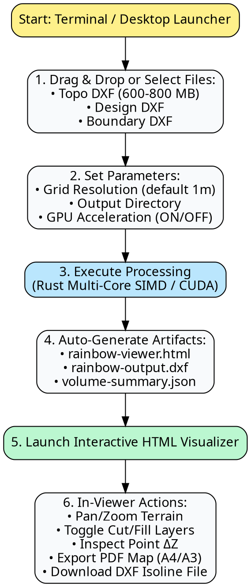

# Userflow & Wireframe Spec: Rainbow Contour

- **Document ID**: UF-01-RAINBOW-CONTOUR
- **Project**: Rainbow Contour (`rainbow-contour`)
- **Date**: 2026-07-29

---

## 1. End-to-End Userflow



---

## 2. Interface Wireframe Layouts

### 2.1 CLI / Script Interactive Prompt Wireframe

```
======================================================================
  RAINBOW CONTOUR - Cut & Fill Difference Map Generator v1.0
  Powered by Rust Multi-Core Engine + Neobrutalism Visualizer
======================================================================

[1/3] Select Topo DXF File    : [ C:/Mining/2026-07-TOPO-PIT-A.dxf ] (782 MB)
[2/3] Select Design DXF File  : [ C:/Mining/PIT-A-DESIGN-FINAL.dxf ] (45 MB)
[3/3] Select Boundary DXF     : [ C:/Mining/PIT-A-BOUNDARIES.dxf ]   (2 MB)

Grid Resolution Step          : [ 1.0 meter ] (Slider: 0.5m - 5.0m)
Hardware Acceleration Mode    : [ AUTO (NVIDIA GeForce CUDA Detected) ]

> Press [ENTER] to execute computation...

[==================================================] 100% 
--> Parsed 14,250,120 entities in 1.24s
--> Computed 18,400,000 grid points in 0.85s
--> Marching Squares generated 42,100 isoline segments in 0.42s

SUCCESS! Output generated in ./output/
 - Interactive Viewer : output/rainbow-viewer.html
 - Export Vector DXF  : output/rainbow-output.dxf
 - Volume Summary     : output/volume-summary.json

Opening browser viewer...
```

---

### 2.2 Interactive HTML Visualizer Layout (Neobrutalism)

```
+-----------------------------------------------------------------------------------+
| [RAINBOW CONTOUR ENGINE]  Pit A July 2026 Cut & Fill Map    [ Export PDF ] [ DXF ]|
+--------------------------+--------------------------------------------------------+
| CONTROL PANELS           | MAIN INTERACTIVE CANVAS VIEW                          |
|                          |                                                        |
| Layer Toggles:           |   +------------------------------------------------+   |
| [x] Elevation Heatmap    |   |                                                |   |
| [x] Isoline Contour Lines|   |            /---\ (Fill +2.5m)                  |   |
| [x] Boundary Polygons    |   |           /     \                          |   |
| [ ] Sample Grid Points   |   |          |  (0m) |                         |   |
|                          |   |           \     /                          |   |
| Gradient Color Bar:      |   |            \---/ (Cut -4.1m)                   |   |
|  +5m [ BLUE ]            |   |                                                |   |
|   0m [ YELLOW ]          |   +------------------------------------------------+   |
|  -5m [ MAGENTA ]         |                                                        |
|                          +--------------------------------------------------------+
| Volume Summary Table:    | COLOR LEGEND BAR                                       |
| Area 1: Cut 42,150 m³    | [-5m Magenta | -2m Red | 0m Yellow | +2m Cyan | +5m Blue]|
| Area 1: Fill 12,400 m³   +--------------------------------------------------------+
| Area 1: Net -29,750 m³   | Status: Coordinates X: 451204.2, Y: 9812401.5 | ΔZ: -1.2m|
+--------------------------+--------------------------------------------------------+
```
